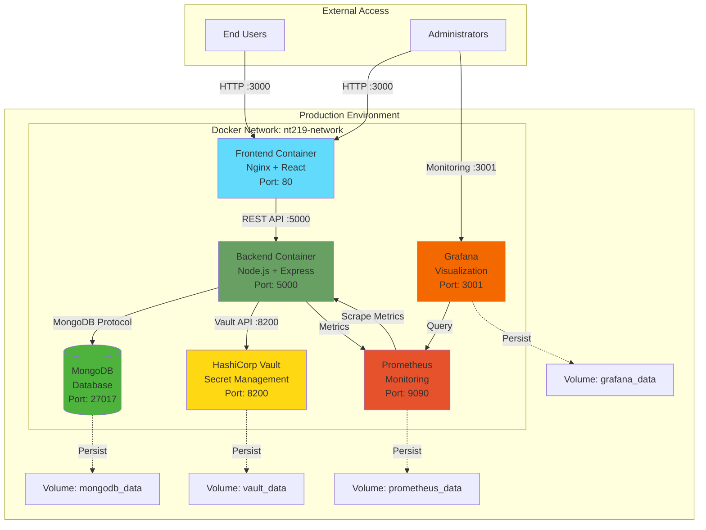
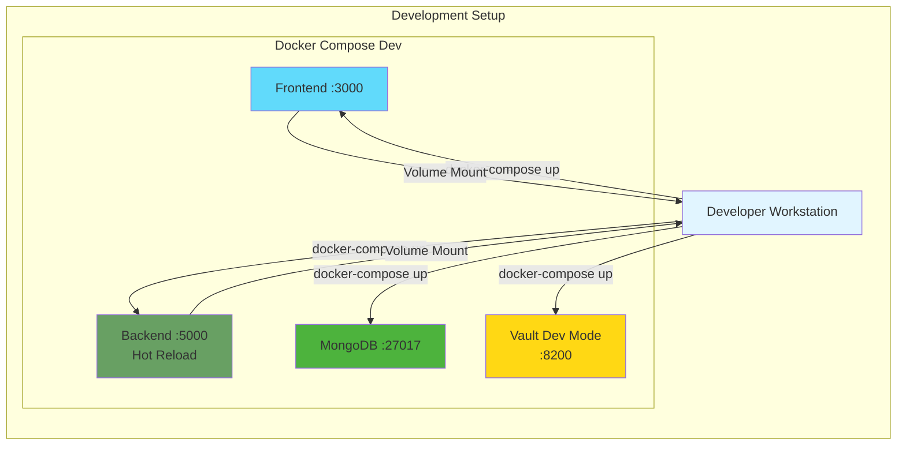
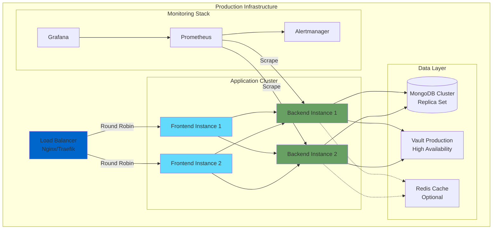
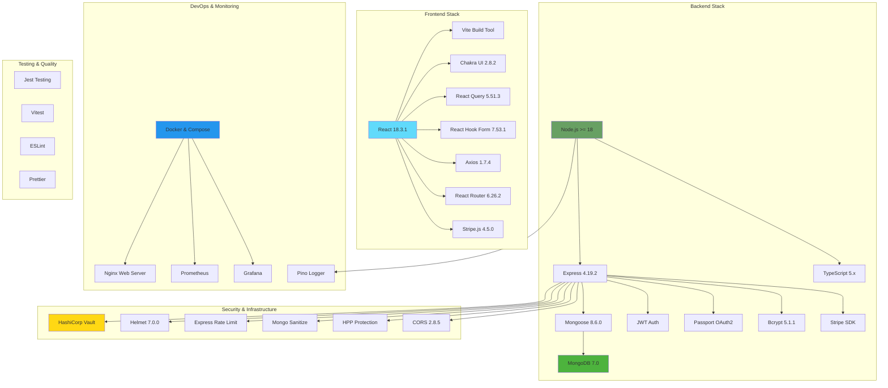
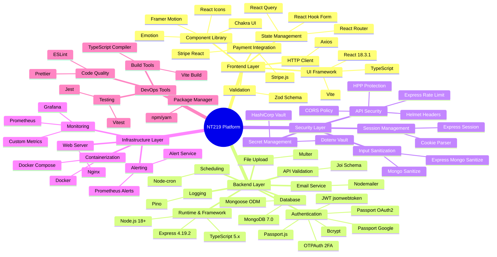
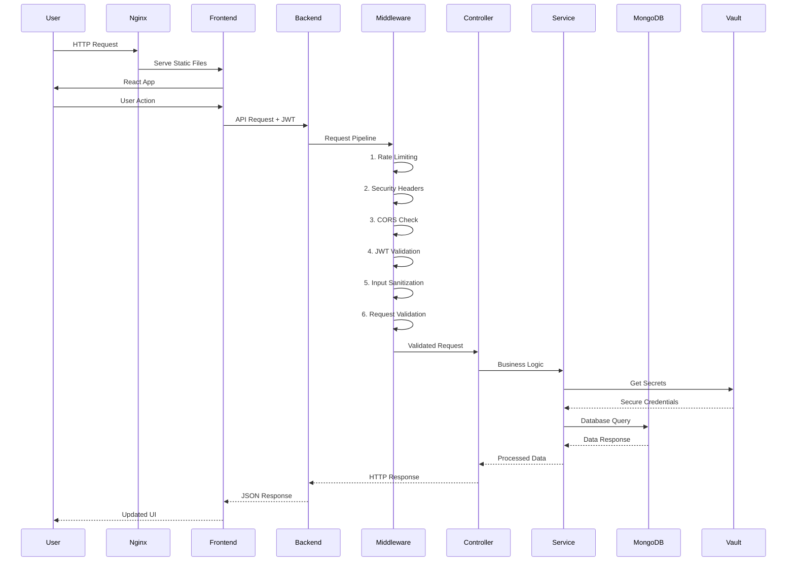

# 4.1. Triển khai hệ thống

## 4.1.1. Môi trường

### Sơ đồ kiến trúc triển khai

### Chi tiết môi trường triển khai

#### Development Environment

#### Production Environment

---

## 4.1.2. Công nghệ sử dụng

### Sơ đồ Stack công nghệ tổng quan

### Chi tiết công nghệ theo layer

### Bảng công nghệ chi tiết

#### Frontend Technologies

| Công nghệ | Version | Mục đích |
|-----------|---------|----------|
| React | 18.3.1 | UI Framework chính |
| TypeScript | 5.4.5 | Type Safety |
| Vite | Latest | Build Tool & Dev Server |
| Chakra UI | 2.8.2 | Component Library |
| React Query | 5.51.3 | Server State Management |
| React Hook Form | 7.53.1 | Form Management |
| Axios | 1.7.4 | HTTP Client |
| React Router | 6.26.2 | Client-side Routing |
| Stripe React | 2.8.0 | Payment Integration |
| Zod | 3.23.8 | Schema Validation |
| Framer Motion | 12.23.24 | Animations |
| Nginx | Latest | Web Server & Reverse Proxy |

#### Backend Technologies

| Công nghệ | Version | Mục đích |
|-----------|---------|----------|
| Node.js | >= 18 | JavaScript Runtime |
| Express | 4.19.2 | Web Framework |
| TypeScript | 5.x | Type Safety |
| MongoDB | 7.0 | NoSQL Database |
| Mongoose | 8.6.0 | MongoDB ODM |
| Passport.js | 0.7.0 | Authentication Middleware |
| jsonwebtoken | 9.0.2 | JWT Authentication |
| Bcrypt | 5.1.1 | Password Hashing |
| OTPAuth | 9.4.1 | Two-Factor Authentication |
| Joi | 17.12.1 | Schema Validation |
| Multer | 1.4.5 | File Upload |
| Nodemailer | 7.0.10 | Email Service |
| Node-cron | 4.2.1 | Task Scheduling |
| Pino | 9.3.0 | Structured Logging |

#### Security & Infrastructure

| Công nghệ | Version | Mục đích |
|-----------|---------|----------|
| HashiCorp Vault | Latest | Secret Management |
| Helmet | 7.0.0 | Security Headers |
| CORS | 2.8.5 | Cross-Origin Policy |
| Express Rate Limit | 6.10.0 | Rate Limiting |
| HPP | 0.2.3 | HTTP Parameter Pollution |
| Mongo Sanitize | 2.2.0 | Input Sanitization |
| Docker | Latest | Containerization |
| Docker Compose | Latest | Multi-container Management |
| Prometheus | Latest | Metrics Collection |
| Grafana | Latest | Metrics Visualization |

### Luồng xử lý request

### Kiến trúc bảo mật

```mermaid
graph TB
    subgraph "Security Layers"
        L1[Layer 1: Network Security]
        L2[Layer 2: Application Security]
        L3[Layer 3: Authentication & Authorization]
        L4[Layer 4: Data Security]
        L5[Layer 5: Monitoring & Audit]
    end
    
    subgraph "Layer 1: Network"
        DOCKER_NET[Docker Network Isolation]
        CORS_P[CORS Policy]
        RATE_L[Rate Limiting]
        HELMET_H[Security Headers]
    end
    
    subgraph "Layer 2: Application"
        INPUT_VAL[Input Validation - Joi]
        SANITIZE[Input Sanitization]
        HPP_P[HPP Protection]
        XSS[XSS Prevention]
    end
    
    subgraph "Layer 3: Auth"
        JWT_A[JWT Authentication]
        OAUTH[OAuth2 - Google]
        MFA[2FA - OTPAuth]
        SESSION[Session Management]
        BCRYPT_P[Password Hashing]
    end
    
    subgraph "Layer 4: Data"
        VAULT_S[Secret Management - Vault]
        ENCRYPT[Data Encryption]
        MONGO_SEC[MongoDB Security]
    end
    
    subgraph "Layer 5: Monitor"
        AUDIT_LOG[Audit Logging]
        PINO_L[Structured Logging]
        METRICS[Prometheus Metrics]
        ALERTS[Alert System]
    end
    
    L1 --> DOCKER_NET
    L1 --> CORS_P
    L1 --> RATE_L
    L1 --> HELMET_H
    
    L2 --> INPUT_VAL
    L2 --> SANITIZE
    L2 --> HPP_P
    L2 --> XSS
    
    L3 --> JWT_A
    L3 --> OAUTH
    L3 --> MFA
    L3 --> SESSION
    L3 --> BCRYPT_P
    
    L4 --> VAULT_S
    L4 --> ENCRYPT
    L4 --> MONGO_SEC
    
    L5 --> AUDIT_LOG
    L5 --> PINO_L
    L5 --> METRICS
    L5 --> ALERTS
    
    style L1 fill:#ff6b6b
    style L2 fill:#ffd93d
    style L3 fill:#6bcf7f
    style L4 fill:#4d96ff
    style L5 fill:#a78bfa
```

---

## Tổng kết

### Đặc điểm nổi bật của hệ thống

1. **Kiến trúc Microservices với Docker**
   - Containerization đầy đủ cho tất cả services
   - Cách ly môi trường dev và production
   - Dễ dàng scale và deploy

2. **Bảo mật đa lớp**
   - HashiCorp Vault cho quản lý secrets
   - JWT + OAuth2 + 2FA authentication
   - Multiple security middlewares
   - Input validation và sanitization

3. **Monitoring & Observability**
   - Prometheus metrics collection
   - Grafana dashboards
   - Structured logging với Pino
   - Health checks và alerting

4. **Modern Technology Stack**
   - React 18 với Vite (Fast builds)
   - TypeScript toàn bộ codebase
   - MongoDB 7.0 (Latest stable)
   - Node.js 18+ (LTS)

5. **Developer Experience**
   - Hot reload trong development
   - TypeScript cho type safety
   - ESLint + Prettier cho code quality
   - Comprehensive testing setup
